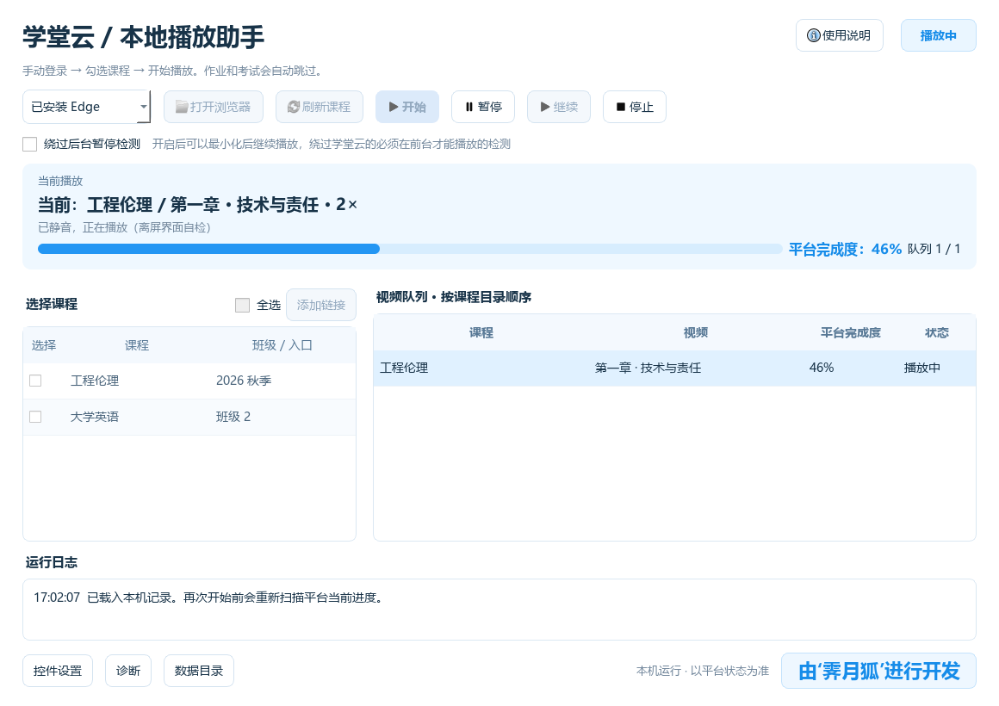
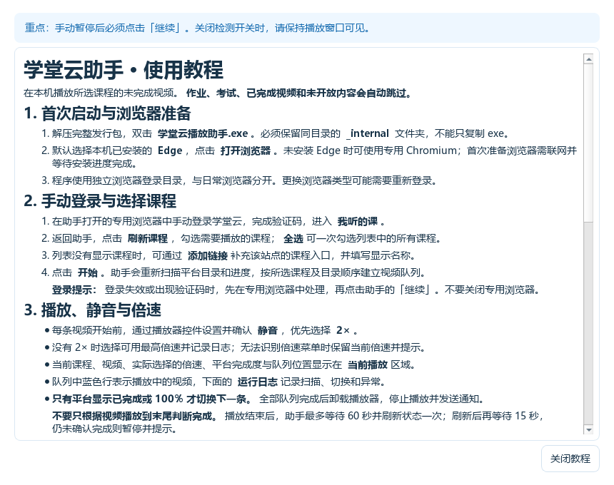

# 学堂云/雨课堂刷网课助手

**由‘霁月狐’进行开发** · Windows 桌面应用 · Python / PySide6 / Playwright

## 适用学校与兼容性说明（请先阅读）

> **本项目专为“滇池学院”的学堂云/雨课堂网课环境开发与适配，目前仅验证 `dcc.yuketang.cn`。其他学校的平台域名、版本或播放器配置可能不同，因此不保证能够使用。**
>
> **如果无法使用，请联系 QQ：1658399029。** 联系时请说明学校、平台网址、软件版本及具体问题，便于排查。

手动登录学堂云后，勾选多门课程，助手按课程目录依次播放未完成的视频，自动静音、优先选择二倍速，并以平台显示的完成度决定何时切换下一条。提供白色天蓝界面、视频队列、运行日志和离线使用教程。

目前仅适配 **https://dcc.yuketang.cn**，浏览器使用独立本地登录配置。仓库地址保留英文名称 `xuetang-video-assistant`，项目展示名称为“学堂云/雨课堂刷网课助手”。

**[下载最新 Windows 版本](https://github.com/zicijieshuo/xuetang-video-assistant/releases/latest)** · **[详细使用教程](docs/使用教程.md)** · **[提交问题](https://github.com/zicijieshuo/xuetang-video-assistant/issues)**

## 界面预览



截图使用模拟课程数据；真实课程名称、视频及进度从当前平台页面读取。

## 功能

| 功能 | 行为 |
| --- | --- |
| 多课程选择 | 手动登录后刷新课程，勾选多门课程，按目录串行处理。 |
| 视频筛选 | 跳过作业、考试、已完成、锁定及类型不明确的节点。 |
| 静音与倍速 | 每条视频确认实际静音，优先 2×；没有 2× 时选择可用最高倍速并记录。 |
| 自动切换 | 平台显示已完成或 100% 后进入下一条；末条完成后卸载播放器。 |
| 绕过后台暂停检测 | 可选开关，开启后允许最小化或切换标签页；关闭后需保持播放窗口可见。 |
| 后台切换 | 开启上述开关时沿用原播放标签页，避免切换视频使最小化窗口弹出。 |
| 任务控制 | 暂停、继续、停止；手动暂停必须手动继续，重新开始会刷新平台进度。 |
| 状态与诊断 | 显示当前视频、平台完成度、队列、日志，提供控件设置及诊断。 |
| 离线教程 | 右上角使用说明打开富文本教程，不暂停运行中的任务。 |

开启 **绕过后台暂停检测** 后可以最小化后继续播放，绕过学堂云的必须在前台才能播放的检测。该选项使用浏览器 CDP 焦点模拟和已适配播放器控件交互；不修改学习进度，也不调用进度上报接口。完成情况始终以平台显示为准。

## 下载与运行

1. 在 [Releases](https://github.com/zicijieshuo/xuetang-video-assistant/releases/latest) 下载 `XuetangAssistant-v1.0.0-Windows-x64.zip`。
2. 解压整个压缩包，双击 `XuetangAssistant/学堂云播放助手.exe`。**保留 `_internal` 文件夹，不能只复制 exe。**
3. 默认使用已安装的 Edge，点击 **打开浏览器**。未安装 Edge 时可准备专用 Chromium，首次准备需要联网。
4. 在专用浏览器中手动登录，完成验证码，进入学堂云“我听的课”。
5. 回到助手，点击 **刷新课程**，勾选课程并点击 **开始**。
6. 按需勾选 **绕过后台暂停检测**。登录失效或出现弹窗时，先处理页面，再点击 **继续**。

Windows 发行包为 **64 位**。源码开发和打包已在 Python 3.11、Windows 环境验证。源码不包含浏览器登录配置，软件也不会代填密码或验证码。

## 使用教程

点击主界面右上角 **使用说明**，打开可滚动的 **使用教程**。教程包含启动、登录、选课、静音与倍速、后台开关、暂停与停止以及常见异常处理，支持关闭后重新打开。



文档入口：[使用教程](docs/使用教程.md)、[使用说明](docs/使用说明.md)、[架构说明](docs/架构说明.md)、[验证记录](docs/验证记录.md)、[发布说明](docs/发布说明.md)。

## 本机数据与升级

登录配置、控件设置、任务记录、日志和开关偏好保存在 `%LOCALAPPDATA%/XuetangAssistant`，与源码和发行包目录分开。独立浏览器配置可能包含登录会话，请勿上传或分享该目录。

升级时先退出旧助手，再解压完整新版并运行。现有登录配置和偏好会沿用；重启后不会自动播放，再次开始会重新扫描平台进度。退出助手会停止任务并关闭专用浏览器。

## 源码运行与打包

```powershell
git clone https://github.com/zicijieshuo/xuetang-video-assistant.git
cd xuetang-video-assistant
python -m venv .venv
.\.venv\Scripts\python.exe -m pip install -r requirements.txt
.\.venv\Scripts\python.exe -m playwright install chromium
.\.venv\Scripts\python.exe main.py
```

运行测试与构建：

```powershell
.\.venv\Scripts\python.exe -m pytest -q
.\build.ps1
```

`build.ps1` 默认先运行测试，再使用 PyInstaller 输出 `dist/XuetangAssistant`。Windows 原生浏览器测试需要本机安装 Edge；其余站点测试使用模拟页面。所有代码及文档使用 UTF-8。

发行包可在独立测试数据目录运行 `学堂云播放助手.exe --self-test`，检查打包驱动、文档和离屏界面；指定 `XUETANG_SMOKE_CHANNEL=msedge` 时额外检查 Edge 控制。详细结果见验证记录。

## 验证与适配范围

- 原有完整测试 **49 项通过**，覆盖混合目录、跨课程队列、静音、倍速回退、完成切换、用户暂停及后台模式。
- 最小化后连续切换视频已使用真实 Edge 与模拟站点验证。
- 默认 1160×820、最小 900×660 窗口及 Qt 模拟 125% / 150% 缩放检查通过。
- 实际 Windows exe 启动自检通过；教程滚动、单实例及关闭重开检查通过。
- 真实课程目录、静音和二倍速已联调；真实平台后台连续完成和 Windows 通知横幅送达未做完整验证。

网站更新可能使选择器失效。遇到无法识别目录、视频或完成度时，程序会暂停提示；诊断信息和日志可辅助定位问题。播放结束而平台未确认完成时，助手等待并重新检查，仍未完成则暂停。

## 反馈问题

通过 [Issues](https://github.com/zicijieshuo/xuetang-video-assistant/issues) 提供版本号、浏览器类型、操作步骤及错误提示。截图请遮挡个人信息；不要提交密码、Cookie、令牌或浏览器配置目录。

开发者：**霁月狐**。项目目前未配置开源许可证；第三方依赖的许可随其发行文件提供。
